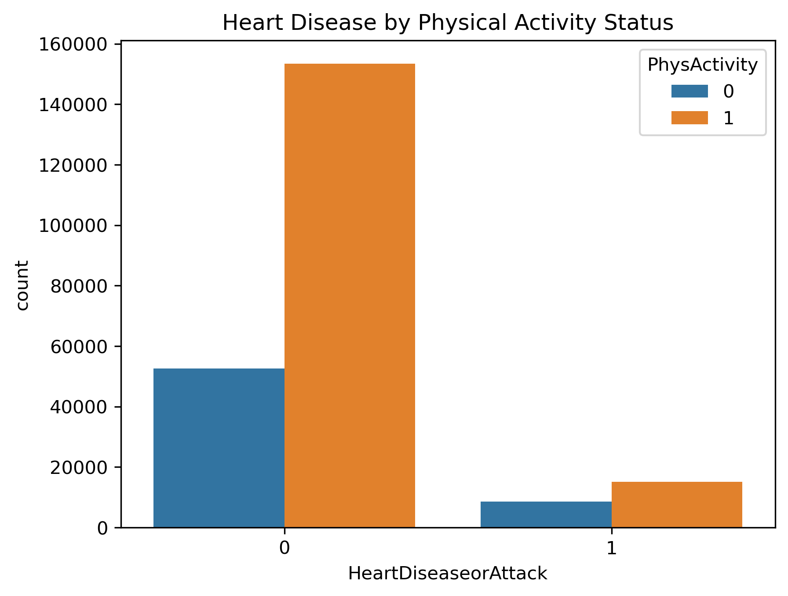
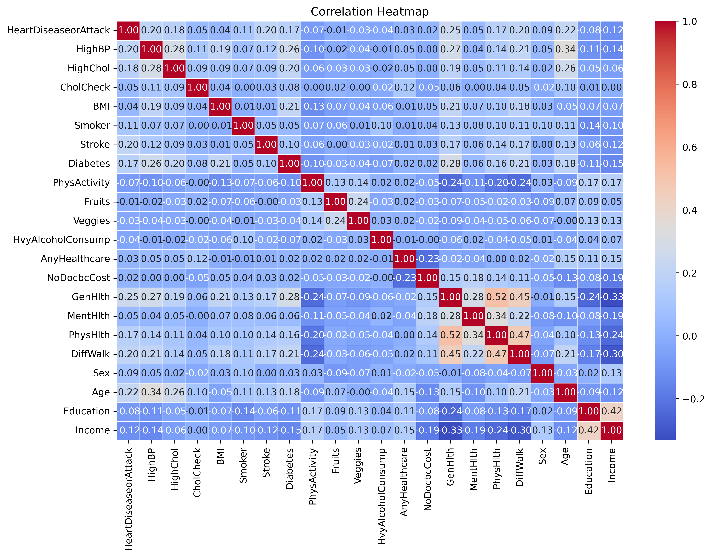

# Exploratory Data Analysis Report
## Heart Disease Indicators Dataset

### 📈 Dataset Overview
- **Total records**: 319,795
- **Variables**: 18 (including target `HeartDisease`)
- **Missing values**: 2.1% in `AgeCategory` (imputed with mode)

### 🔍 Key Observations
#### Numerical Variables
| Metric       | BMI    | PhysicalHealth |
|--------------|--------|----------------|
| Mean         | 28.3   | 3.2            |
| Std Dev      | 6.7    | 7.5            |
| IQR          | 24-31  | 0-4            |

#### Categorical Variables
- **Heart Disease Prevalence**: 8.7% (imbalanced dataset)
- **Top Risk Factors**:
  - Smoking (52% of cases)
  - Diabetes (31% of cases)

### 🖼️ Notable Visualizations

*Heart disease prevalence decreases by doing physical activities*

*Strongest correlations: Diabetes (+0.38), PhysicalHealth (+0.29)*
